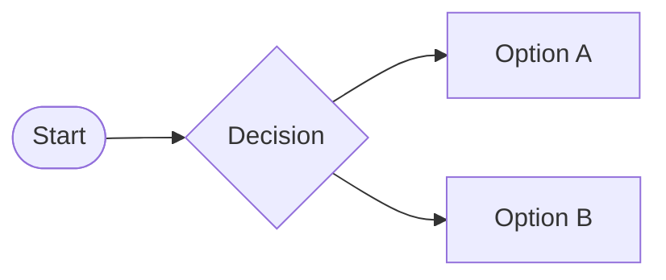

# markdown-it-mermaid-server

A [markdown-it](https://github.com/markdown-it/markdown-it) plugin to transform textual [Mermaid](https://mermaid.js.org) diagram definitions into SVG images.

markdown-it-mermaid-server runs on the server as part of the markdown-it transformation. The produced SVG images will be referenced in the Markdown-rendered HTML documents without the need of any Mermaid code running on the browser client. The plugin is perfectly suited for the build process of Static Site Generators (SSG), like for example [11ty](https://www.11ty.dev).

In your Markdown, describe the Mermaid chart within a fenced codeblock, introduced with the `mermaid` keyword:

~~~markdown

~~~

and get the chart, wrapped into a `figure` tag:

```html
<figure class="mermaid"><svg aria-roledescription="flowchart-v2" role="graphics-document document" viewBox="0 0 410.96875 174" id="mermaid-ttzhcnghnsgr"...></svg></figure>
```

## Accessibility

To improve the accessibility of the resulting charts, the plugin allows to add a `figcaption` and `alt` text to every diagram definition, introduced by the keywords `figcaption` and `alt`. For example:

~~~markdown
```mermaid
flowchart LR
figcaption This is the figcaption of the flow chart
alt This is the alt text of the flow chart
A(["Start"]) --> B{"Decision"}
B --> C["Option A"] & D["Option B"]
```
~~~

As result, you get:

```html
<figure class="mermaid"><svg aria-label="This is the alt text of the flow chart" aria-roledescription="flowchart-v2" role="graphics-document document" viewBox="0 0 410.96875 174" id="mermaid-ttzhcnghnsgr"...></svg><figcaption>This is the figcaption of the flow chart</figcaption></figure>
```

The two properties are identified, interpreted and then removed by the plugin before handing over the chart definition to mermaid for chart generation, otherwise the chart rendering process would throw a syntax error. It does not matter in what line of the chart definition the properties are located. It´s only important that they have to stay in a single line each, and that the beginning of the line starts with either the keyword `figcaption` or `alt`.

## Install

mermaid-cli-batch has a peer dependency to playwright that you have to install by yourself prior of using the package:

```sh
npm i playwright
npx playwright install chromium
```

Then install the package itself:

```sh
npm install markdown-it-mermaid-server
```

## Use

```js
import markdownItMermaidServer from 'markdown-it-mermaid-server'
import markdownIt from 'markdown-it'

const md = markdownIt()

//default settings
const markdownItMermaidOptions = {
  workingFolder: "mermaidTmp",
  clearWorkingFolder: false,
  throwOnError: false,
  verbose: false,
  useCache: true,
};

md.use(markdownItMermaidServer, markdownItMermaidOptions)
```

## Options

Use the `workingFolder` exclusively for markdown-it-mermaid-server and not for other content. It also makes sense to have the folder part of your `.gitignore` file to avoid having the generated content being part of your code versioning.

- `workingFolder`: A temporary folder to used to transform the Mermaid diagram definitions into SVG images. The default name of the folder is `mermaidTmp`. **Add the folder to your `.gitignore` file, because it doesn´t require code versioning**.
- `clearWorkingFolder`: A value of `true` will delete the working folder when initializing the plugin. Default is `false`.
- `throwOnError`: A value of `true` will throw errors that occurred during processing. A value of `false` will only log errors. Default value is `false`.
- `verbose`: A value of `true` will activate detailed logging. Default is `false`.
- `useCache`: A value of `true` will activate the internal cache, which will render every chart only once with mermaid-cli and if the same chart (definied by its chart definition) is requested again, will use a cache to to render the inline svg. In local development scenarios this can save a lot of time for repeated builds. Default is `true`.
